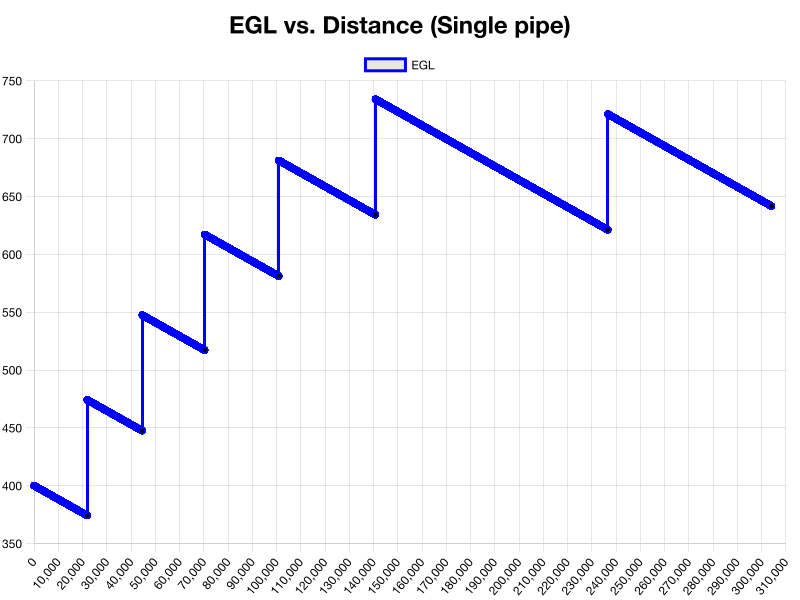

<p align="center">
  
</p>

# Pipedream

Simulates the water in a 304km long pipeline and optimizes its cost by adjusting the pipe's diameter or by burying the pipe underground. Minimizes energy costs and dangerous pressures. Developed in UBC CIVL 215's Final Design Project.

> **CIVL_V 215 (4) Fluid Mechanics I**
> 
> Fluid properties, hydrostatics, kinematics, and fluid dynamics: energy and momentum methods with applications. Dimensional analysis, modelling, introduction to flow in pipes and forces on immersed objects. *Prerequisite: All of PHYS 170, MATH 101.*

## Example Output

### Optimized solution (Pipe above ground)

<p align="center">
  
</p>

```
===== CURRENT OPTIMAL SOLUTION =====
Diameter        : 1.099716 m
Percent Buried  : 0.000000 %
Number of Pumps : 6

---- Cost Breakdown ----
Pipe Cost       : $70,339,788.61
Burial Cost     : $0
Pump Cost       : $90,000,000
--------------------------
Total Cost      : $160,339,788.61
=====================================
```

### Optimized solution (Now partially burying pipe into the ground, taking into account burying costs)

<p align="center">
  
</p>

```

===== CURRENT OPTIMAL SOLUTION =====
Diameter        : 1.099716 m
Percent Buried  : 0.000300 %
Number of Pumps : 5

---- Cost Breakdown ----
Pipe Cost       : $70,339,788.61
Burial Cost     : $152
Pump Cost       : $75,000,000
--------------------------
Total Cost      : $145,339,940.61
=====================================
```

`$14,999,848` saved with burying, because while it is expensive to bury the pipe, it allows for one less pump!

### Now with two pipelines running alongside each other

<p align="center">
  
</p>

```
===== CURRENT OPTIMAL SOLUTION =====
Diameter        : 1.003169 m
Percent Buried  : 0.000000 %
Number of Pumps : 7

---- Cost Breakdown ----
Pipe Cost       : $36,895,302.19
Burial Cost     : $0
Pump Cost       : $105,000,000
--------------------------
Total Cost      : $141,895,302.19
=====================================
```

`$3,444,638.42` saved with two pipes! You need more pumps, but the pipes can be thinner.

### Now with two pipelines running alongside each other + burying the pipes

<p align="center">
  
</p>

```
===== CURRENT OPTIMAL SOLUTION =====
Diameter        : 1.003170 m
Percent Buried  : 0.000000 %
Number of Pumps : 6

---- Cost Breakdown ----
Pipe Cost       : $36,895,607.93
Burial Cost     : $0
Pump Cost       : $90,000,000
--------------------------
Total Cost      : $126,895,607.93
=====================================
```

`$14,999,694.26` saved with burying the two pipes, because while it is expensive to bury the pipes, it allows for one less pump! This is the most optimal solution at `$126,895,607.93`

<br/>
<br/>
<br/>

# Full Deep Dive

## Standard Solution

My standard solution was in excel, where I was simulating the pipeline kilometer-by-kilometer. In some of my equations, like head loss, I was computing the head loss over 1 meter instead of 1000. This means I did not use as many pumps as I should have.

My fixed standard solution spreadsheet is here:
https://docs.google.com/spreadsheets/d/1OqXm75v2nsE-uen52Ci5M-Y0KyZp9dz5ESuznx0ytK0/edit#gid=0

Main standard solution issues I wanted to address in this final report:

-   You can’t have it decide where to put the pumps automatically since the pressure depends on the pumps, and the pumps affect the pressure. This circular logic means you have to do it manually
-   You can only try a select number of diameters
-   It does not simulate burying the pipe at all
-   It only does one pipe

## Introduction to New Solution

My strategy to solving this problem was to write a program that could do the following:

1. Choose any diameter pipe and compute the pipe’s
   a. Estimated cost per meter
   b. Relative roughness
   c. Area
   d. Velocity
   e. Reynolds Number
2. Choose any amount of pipe burying
3. Choose one pipe or two parallel pipes
4. Simulate the entire pipeline with these choices, and figure out where to place the pumps to fit within the pressure constraints
5. Compute the cost of any combination of the above scenarios
6. Find the lowest cost combination

## New Solution

The new program I wrote is in this repo, namely
[`dual-pipes.ts`](src/dual-pipes.ts)
and
[`single-pipe.ts`](src/single-pipe.ts)

Basically the code goes like this:

-   For any diameter between min and max…
    -   Compute all the pipe’s properties with that diameter
        For any amount of burying the pipe between min and max… - For each meter of pipe at distance d… - Decide whether to place a pump
        Compute the head, pressure, loss, EGL, HGL, etc. - Is the cost of this configuration the least so far?

It simulates each pipeline meter-by-meter for accuracy, placing the pumps properly, and then finding the costs of thousands of these configurations. **I tested roughly 100,000 of these valid configurations**. Of these, I was looking for the cheapest to build. Then I redid it all for the dual pipe configuration.

This was somewhat slow. While I left it running, **my computer computed the pressure in the pipe at some distance d [meters] about 120 billion times**. I was able to narrow in on the most optimal parameters, and then work on getting numerical precision, which helped reduce compute time.

Although my strategy is basically bruteforce, I was confident that some configuration in the given bounds was the “best” and I hoped to find it.

The code could be modified to account for a changing pipe diameter, which would be interesting for a future attempt.

### Note:

-   The equation I used for the pipe cost for any given diameter was estimated using linear regression from the given data in the problem. A pipe of ~0.7m diameter was set as the minimum because virtually free piping for very small diameters doesn’t make sense.

<p align="center">
  
</p>

-   **Friction factor for any pipe diameter was estimated using 200 iterations of the Colebrook-White equation**

-   Burying the pipe was done by

        -   Calculating the gap (in meters) between the z-elevation of the land and a hypothetical straight line between the reservoirs
        -   Burying the pipe some percent of this “deviation” along the pipeline
        -   100% percent_bury would mean the pipe is a straight line right through the ground
        -   0% means it’s sitting on the ground, no burying

    <p align="center">
      
    </p>

-   The pipeline always starts with a pump
-   A pump is placed when the program judges that it’s needed and safe to do so regarding pressure constraints
-   In terms of pipe costs, the arc length was assumed to be the same as the straight line

## Results

### Most Optimal Single Pipeline Output

**Configuration**

```
Diameter:  1.09971599 meters or (~ 1.1 meters)
Percent Buried: 0.000299% (0mm min, 0.7mm max bury distance) (~ 0%)
Number of pumps: 5
```

**Costs**

```
Piping: $70,339,788.61 (~$70.3 million)
Burying: $152
Pumps: $75,000,000
Total: $145,339,940.61
```

**Notes**

The burying is very small, basically only 0.7mm into the ground, at the most. This is largely due to how expensive it was to bury the pipe, for very little benefit. Although this may technically be the most optimal configuration, this is clearly pretty negligible. It seems the program decided it was better to put that money towards a larger pipe.

Distance [meters]

Here you can see the five pumps (including the jump at distance = 0 meters)

The program is capable of plotting the HGL as well, but they are so close at this scale that one is not discernible from the other, so for clarity I left it out. You can toggle the HGL in the code if you want to see it too.

### Most Optimal Parallel Pipeline Output

**Configuration**

```
Effective diameter: 1.003170 meters (~1 meter)
Diameter of each of the two actual pipes:  0.760261 meters (~0.76 meters)
Percent Buried: 0%
Number of pumps: 6
```

**Costs**

```
Piping: $36,895,607.93 (~$36.9 million)
Burying: $0
Pumps: $90,000,000
Total: $126,895,607.93 ($126.9 million)
```

**Notes**

For this system I simulated two pipes running in parallel, using the effective diameter method of
$D_{eff} = D \times 2^\frac{2}{5}$ assuming equal $f$, $L$, $Q$, $D$ of each individual pipe.

It is assumed that the pipes rejoin before entering a pump, and split after leaving a pump. The energy loss of this is not taken into account, but it should be relatively negligible if done smoothly.

I was impressed by **the two pipe setup since it saved $18,444,332.68 (~$18.4 million)**

I was surprised that even though my program needed to add an additional sixth pump to overcome loss (since this pipe’s effective diameter was slightly smaller than the one pipe solution) it was still more economical to do so, since the pipeline savings make up for it.

(The costs per meter of piping = 2 x the cost of one each actual pipe per meter, but the two pipeline system means that the diameter of each pipe can be smaller while still delivering the same combined flow rate)

<p align="center">
  
</p>

Here you can see the six pumps (including the jump at distance = 0 meters)

I am happy with this result because I believe many real pipelines opt for the parallel pipe configuration, so I was glad that I came to the same conclusion.
